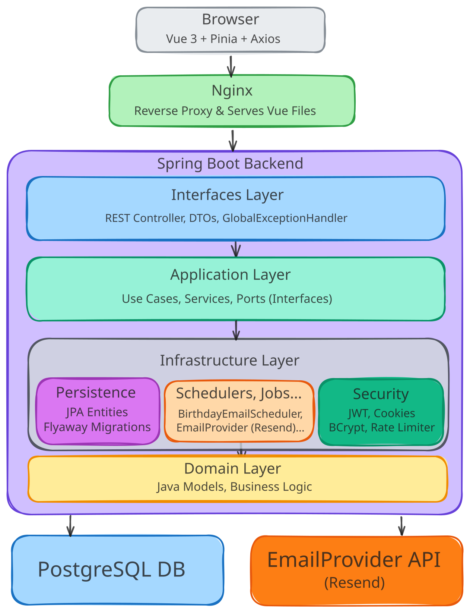
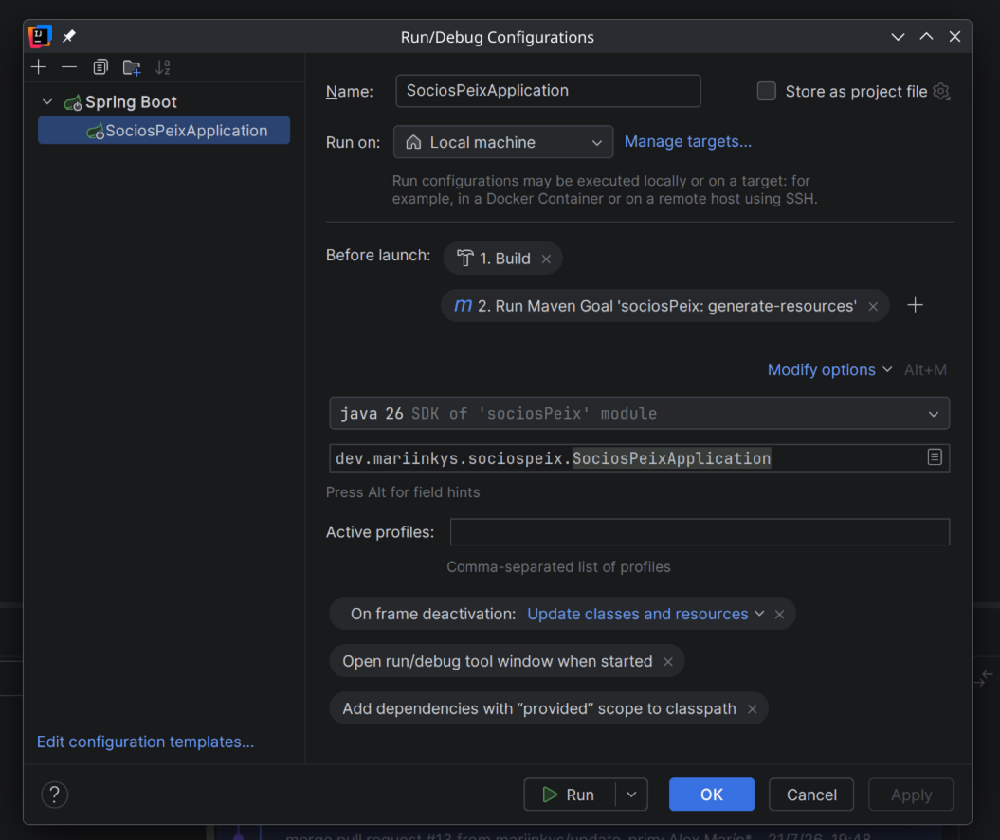

   
  
  <h1>Socios Peix</h1>

<h3>Web application to manage members of a specific hotel in Spain</h3>

## App Overview

    

Note: I've made the diagram using Excalidraw.

## About me

Check out my [other projects](https://github.com/mariinkys)

You can also help do this and more projects, [Buy me a Coffee](https://www.buymeacoffee.com/mariinkys)

## Development Notes

In order to execute the backend and for it to work correctly when using IntelliJ we have to modify the Run/Debug Configurations like this:

## Copyright and Licensing

Copyright 2026 © Alex Marín

Released under the terms of the [GPL-3.0](./LICENSE)
